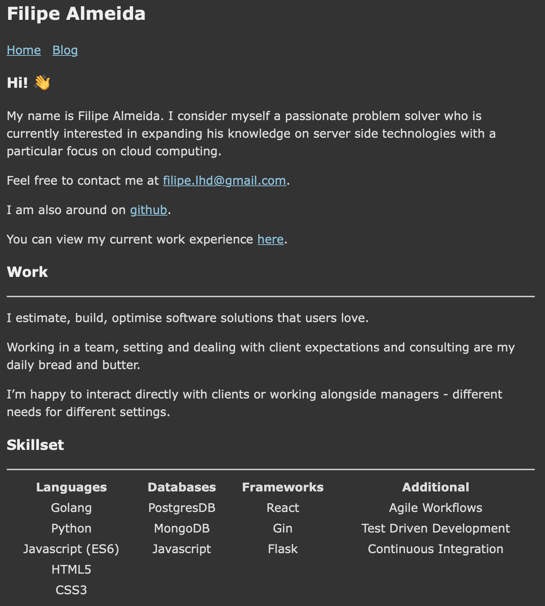
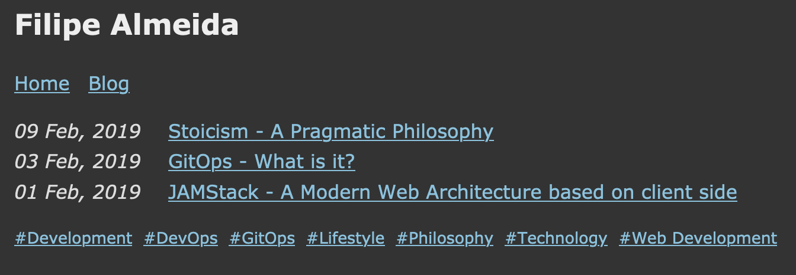

# Filipe Almeida - Website

Personal website and blog where I share my thoughts.

Built with [Hugo](https://gohugo.io) using the
[hugo-bearblog](https://github.com/janraasch/hugo-bearblog) theme.

Deployed through AWS S3 at [https://www.filipe-almeida.com](https://www.filipe-almeida.com).

---

### Home Page


### Posts


---

#### Development
```sh
hugo server -D
```

#### Deployment
Using AWS Amplify so pushing to either `develop` or `main` branches will trigger respective builds.
